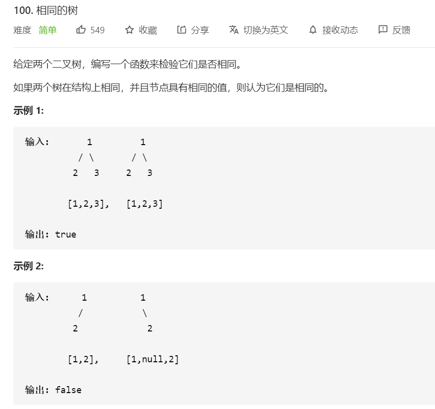

# 100.相同的树

## 题目




## 思路

用字符串拼接的方式记录树的结构，null用 '#'，来记录


## 解题

```javascript
/**
 * Definition for a binary tree node.
 * function TreeNode(val, left, right) {
 *     this.val = (val===undefined ? 0 : val)
 *     this.left = (left===undefined ? null : left)
 *     this.right = (right===undefined ? null : right)
 * }
 */
/**
 * @param {TreeNode} p
 * @param {TreeNode} q
 * @return {boolean}
 */
var isSameTree = function(p, q) {

    const traverse = (root)=>{
        if(root === null) return '#';
        let res = null;
        res=root.val
        res = res + traverse(root.left)
        res = res + traverse(root.right)
        
        return res
    }

    return traverse(p) === traverse(q)
};
```


