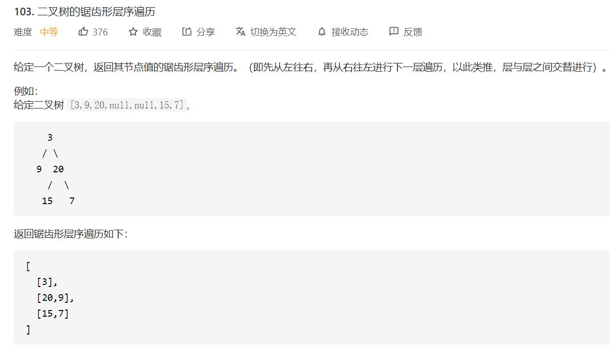

## 题目



## 思路

通过层序遍历，达到条件存放结果时，再判断要不要调整顺序


## 解题

```javascript
/**
 * Definition for a binary tree node.
 * function TreeNode(val) {
 *     this.val = val;
 *     this.left = this.right = null;
 * }
 */
/**
 * @param {TreeNode} root
 * @return {number[][]}
 */
var zigzagLevelOrder = function(root) {
    if(!root) return [];
    const queue = [root];
    const res = []

    while(queue.length){
        const size = queue.length;
        const rowRes = []
        for(let i=0; i<size; i++) {
            const currentNode = queue.shift()
            rowRes.push(currentNode.val)

            // 先不要管顺序，最后放入结果中才调整顺序
            if(currentNode.left !== null){
                queue.push(currentNode.left)
            }
            if(currentNode.right !== null){
                queue.push(currentNode.right)
            }
               

            if(i === size -1){ // 队列中最后一个
                res.length % 2 !== 0 && rowRes.reverse() // 调整顺序
                res.push([...rowRes])
            }
        }
    }
    return res
};
```


