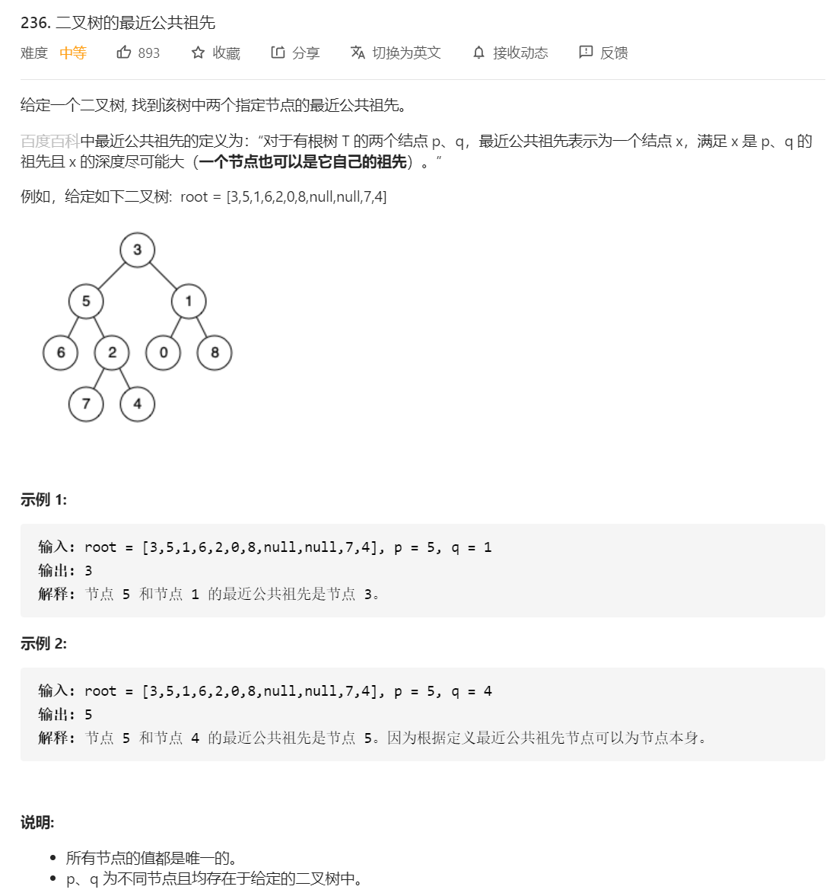

# 236. 二叉树的最近公共祖先

## 题目




## 思路


关键字：二叉树

二叉树一般解题用：递归解决


**一、先判断哪些条件要直接返回**

1、当前节点root是null，直接返回null

2、当前节点root等于 p、q，直接返回当前节点root

**二、记录结果**

将递归返回来的结果记录起来，分别用 left、right 记录左子树、右子树递归返回的结果。

**三、根据结果判断**

根据返回结果 left、right 来判断公共祖先情况：

1、当 left 和 right **同时不为空**，说明： p 和 q 在 root 的异侧，所以root是最近公共祖先，返回 root 。

2、当 left 和 right **同时为空**，说明：root 的左右子树都不包含 p 和 q ，返回 null。

3、当 left 和 right **一个为空另一个不为空时**，说明：一个为空，一个不为空，返回不为空的。 假设 left 为空，right不为空，返回 right 。

解释有两种可能性：

①p 和 q其中一个在 root 的右子树中，返回的是 p 或 q，即 right 指向的是 p 或 q。

②p 和 q都在 root 的右子树中，返回的是最近公共祖先节点，即 right 指向的是最近公共祖先节点。


## 解题

```javascript
/**
 * Definition for a binary tree node.
 * function TreeNode(val) {
 *     this.val = val;
 *     this.left = this.right = null;
 * }
 */
/**
 * @param {TreeNode} root
 * @param {TreeNode} p
 * @param {TreeNode} q
 * @return {TreeNode}
 */
var lowestCommonAncestor = function(root, p, q) {
    // base case
    if(root === null) return null;
    if(root === p || root === q)return root;

    // 递归调用的结果left和right
    // 结果有内容，内容的值可能是：p、q、最近公共祖先

    let left = lowestCommonAncestor(root.left, p, q);
    let right = lowestCommonAncestor(root.right, p, q);

    // 情况 1，如果p和q都在以root为根的树中，那么left和right一定分别是p和q。
    if(left !== null && right !== null){
        return root
    }
    // 情况 2，如果p和q都不在以root为根的树中，直接返回null。
    if(left === null && right === null){
        return null
    }
    // 情况 3，如果p和q只有一个存在于root为根的树中，则判断：left为空，返回right；right为空，返回left。
    return left === null? right : left
};

```


