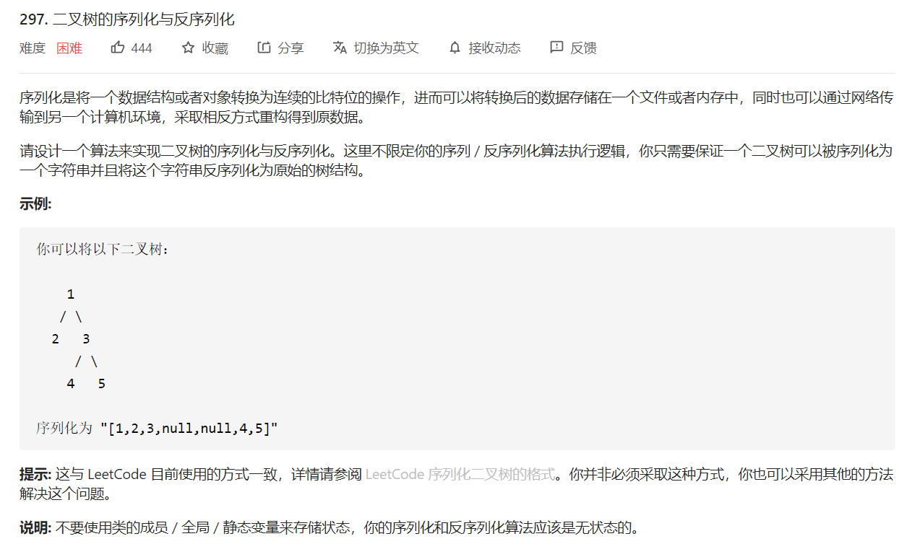
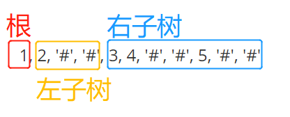

# 297. 二叉树的序列化与反序列化

## 题目



## 思路

序列化就是将一个树打平，用字符串表示。

反序列化就是将字符串中的内容，变成一棵树。

序列化需要遍历二叉树。遍历二叉树的方式有：递归遍历：前序遍历、中序遍历、后序遍历；迭代遍历：一般是层级遍历。


！注意：使用不同的遍历方式，得到的结果不同，在反序列化时，根据不同遍历方式结果的特点，找到根节点。

例如：题目中的例子，序列化使用**前序遍历**，**空节点用 '#' 表示**。序列化得到的结果是： "1, 2, '#', '#', 3, 4, '#', '#', 5, '#', '#'"。




反序列化时，先确定根节点，再进行递归生成左右子树。


## 解题


```javascript
/**
 * Definition for a binary tree node.
 * function TreeNode(val) {
 *     this.val = val;
 *     this.left = this.right = null;
 * }
 */

/**
 * Encodes a tree to a single string.
 *
 * @param {TreeNode} root
 * @return {string}
 */
var serialize = function(root) {
    var res = []
    
    // 前序遍历，将树打平
    var traverse = function(root, res) {

        if(!root) {
            res.push('#');
            return 
        }

        res.push(root.val)

        traverse(root.left, res);
        traverse(root.right, res);
    }
    traverse(root, res)
    
    return res+"" // 将数组变成字符串
};


/**
 * Decodes your encoded data to tree.
 *
 * @param {string} data
 * @return {TreeNode}
 */
var deserialize = function(data) {
    if(!data) return 
    var arr = data.split(","); // 将序列化内容用数组存起来

    // 二叉树节点定义
    function TreeNode(val) {
      this.val = val;
      this.left = this.right = null;
    }

    // 根据前序遍历的特点构造树
    var deTraverse = function(arr) {
       // 注意判空时返回的值
        if(!arr || arr.length === 0) return null
        
        var first = arr.shift() // 取出数组第0个
        if(first === '#') return null // 注意判断节点是否为空节点标注，并作出处理

        var tree = new TreeNode(first) // 注意节点要声明为treeNode

        tree.left = deTraverse(arr)
        tree.right = deTraverse(arr)
        
        return tree
    }

    return deTraverse(arr)
};

/**
 * Your functions will be called as suc=h:
 * deserialize(serialize(root));
 */
```

