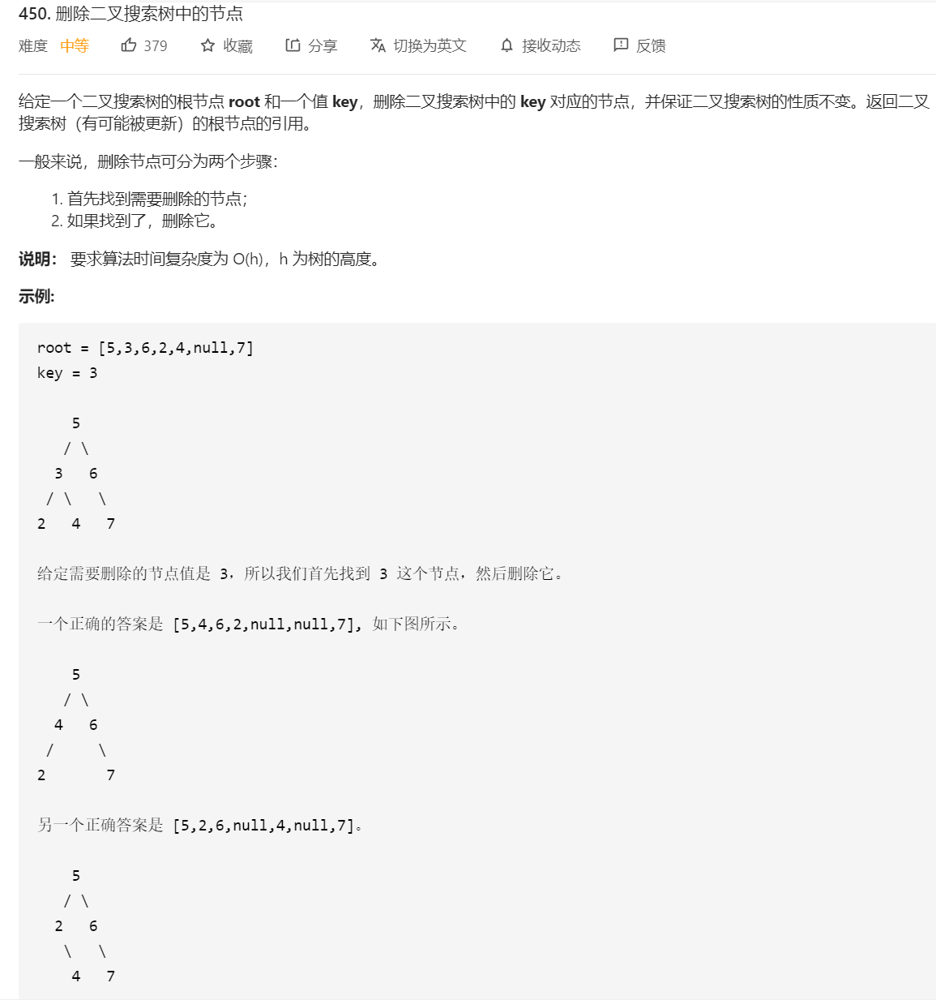

# 450.删除二叉搜索树中的节点

## 题目




## 思路

利用BST的特性，左子树比右子树小，右子树比根小的特点，进行找值。

删除后还得保证树的BST特性，所以要删除的节点在不同的位，处理方式不一样。

要删除的节点，位置有三种情况：

1、要删除的节点，没有孩子，即在末端节点，最后一个，直接删除

2、要删除的节点，有一个孩子，直接让孩子继承自己的位置

3、要删除的节点，有两个孩子，找右子树中最小的节点继承自己的位置。或者，找左子树中最大的节点继承自己的位置。


## 解题

```javascript
/**
 * Definition for a binary tree node.
 * function TreeNode(val, left, right) {
 *     this.val = (val===undefined ? 0 : val)
 *     this.left = (left===undefined ? null : left)
 *     this.right = (right===undefined ? null : right)
 * }
 */
/**
 * @param {TreeNode} root
 * @param {number} key
 * @return {TreeNode}
 */
var deleteNode = function(root, key) {
    if(root === null) return null;
    
    const getMin = (root)=>{
        // 二叉搜索树中最左边的是最小的
        while(root.left !== null) root = root.left
        return root.val
    }

    const deleteN = (root, key)=>{
        if(root === null) return null;
        if(root.val === key){
            // 找到了

            if(root.left === null) return root.right
            if(root.right === null) return root.left

            const minVal = getMin(root.right)
            root.val = minVal // 当前节点改成minVal
            root.right = deleteN(root.right, minVal) // 去删除minVal
        }else if(root.val > key){
            // 要找的值比当前节点值大，去左子树找
            root.left = deleteN(root.left, key) 
        }else if(root.val < key) {
            // 要找的值比当前节点值小，去右子树找
            root.right = deleteN(root.right, key) 
        }
        return root
    }
    
    return root = deleteN(root, key)
};
```


