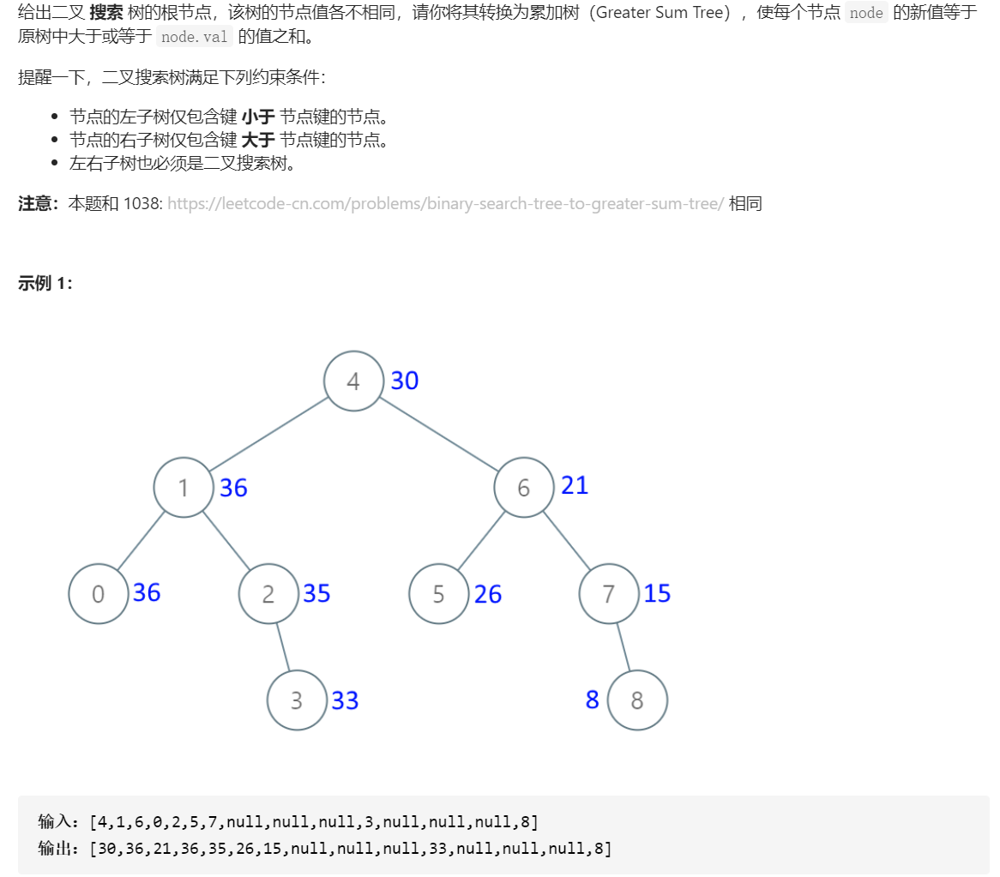

# 538. 把二叉搜索树转换为累加树

## 题目



## 思路

利用二叉搜索树、累加树的特点，使用逆向中序遍历。


## 解题

```javascript
/**
 * Definition for a binary tree node.
 * function TreeNode(val, left, right) {
 *     this.val = (val===undefined ? 0 : val)
 *     this.left = (left===undefined ? null : left)
 *     this.right = (right===undefined ? null : right)
 * }
 */
/**
 * @param {TreeNode} root
 * @return {TreeNode}
 */
var convertBST = function(root) {
    if(root === null) return root
    let sum = 0
    const dfs = (root)=>{
        if(root === null)return

        // 逆向中序遍历。利用累加树每个节点值的特点。
        dfs(root.right)

        sum+=root.val;
        root.val = sum

        dfs(root.left)
    }

    dfs(root, sum);
    return root
};
```


