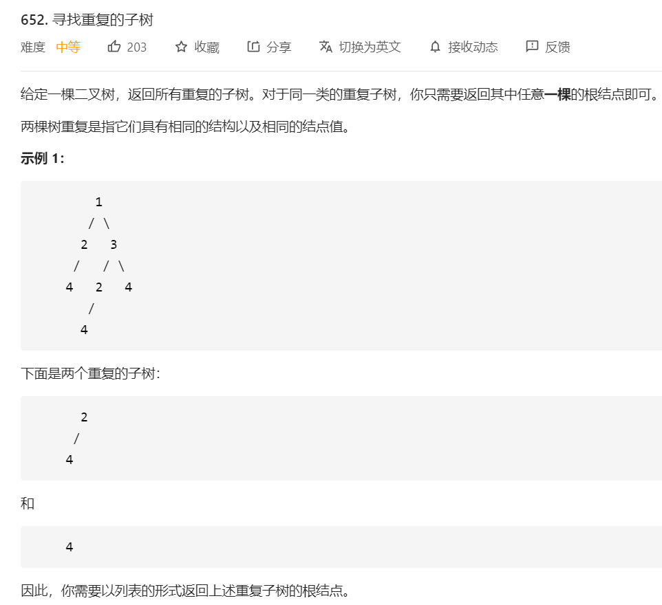

# 652.寻找重复的子树

## 题目




## 思路

后序遍历，将左右根子树存入字典中，判断字典中是否有相同的值，将根值存入结果中


## 解题


```javascript
/**
 * Definition for a binary tree node.
 * function TreeNode(val, left, right) {
 *     this.val = (val===undefined ? 0 : val)
 *     this.left = (left===undefined ? null : left)
 *     this.right = (right===undefined ? null : right)
 * }
 */
/**
 * @param {TreeNode} root
 * @return {TreeNode[]}
 */
/**
 * Definition for a binary tree node.
 * function TreeNode(val, left, right) {
 *     this.val = (val===undefined ? 0 : val)
 *     this.left = (left===undefined ? null : left)
 *     this.right = (right===undefined ? null : right)
 * }
 */
/**
 * @param {TreeNode} root
 * @return {TreeNode[]}
 */

const findDuplicateSubtrees = function(root) {
    const res = []; // 结果数组
    const rootTreeSet = new Map() // 记录全部子树

    const traverse = (root)=> {
        if(!root) return '#'; // 表示空节点

        const subTree = traverse(root.left) + "," + traverse(root.right) + "," + root.val;

        const count = rootTreeSet.get(subTree) // 看看出现过多少次
        if(count === undefined){// 没有子树
            rootTreeSet.set(subTree,1) // 进行记录      
        }else {
            count ===1 && res.push(root) // 次数为1，说明出现过一次，放入结果数组中
            rootTreeSet.set(subTree,count+1) // 子树对应次数加1
        }
        return subTree
    }


    traverse(root)
    return res
}

```
