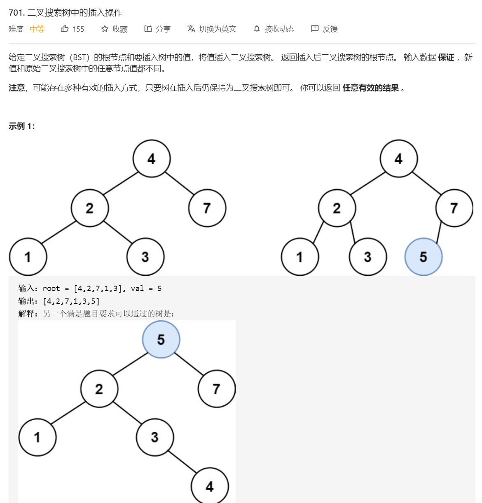

# 701.二叉搜索树中的插入操作

## 题目




## 思路

可以插入不同的地方。

简单的方式，利用BST的左小右大，右比根大的特性，一直找到最下面，将节点插入。


## 解题

```javascript
/**
 * Definition for a binary tree node.
 * function TreeNode(val, left, right) {
 *     this.val = (val===undefined ? 0 : val)
 *     this.left = (left===undefined ? null : left)
 *     this.right = (right===undefined ? null : right)
 * }
 */
/**
 * @param {TreeNode} root
 * @param {number} val
 * @return {TreeNode}
 */
var insertIntoBST = function(root, val) {
    if(root === null)return new TreeNode(val) // 以防这种情况：[] 5

    function TreeNode(val, left, right) {
      this.val = (val===undefined ? 0 : val)
      this.left = (left===undefined ? null : left)
      this.right = (right===undefined ? null : right)
    }
    const dfs = (root)=>{

        if(root === null) {// 没有节点了，这个就是插入的位置
            return true
        }
        if(val > root.val) {
            dfs(root.right) && (root.right = new TreeNode(val))
        }
        if(val < root.val) {
            dfs(root.left) && (root.left = new TreeNode(val))
        }
        return
    }

    dfs(root)
    return root
    
};
```


