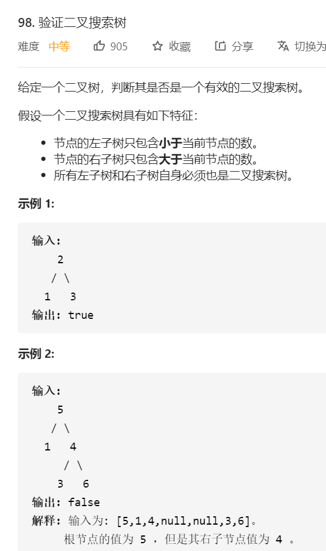

# 98. 验证二叉搜索树

## 题目



## 思路

利用二叉树中序遍历的特点，中序遍历的结果是从小到大的。


## 解题

```javascript
/**
 * Definition for a binary tree node.
 * function TreeNode(val, left, right) {
 *     this.val = (val===undefined ? 0 : val)
 *     this.left = (left===undefined ? null : left)
 *     this.right = (right===undefined ? null : right)
 * }
 */
/**
 * @param {TreeNode} root
 * @return {boolean}
 */
var isValidBST = function(root) {
    
    let flag =-Infinity;
    const dfs = (root)=>{
        if(root === null)return true
        
        if(!dfs(root.left)){
            return false
        }

        if(root.val <= flag){
            return false
        }
        flag = root.val
        
        return dfs(root.right)
    }

    return dfs(root)
};
```


