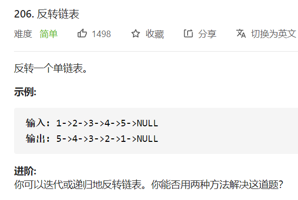

# 206. 反转链表

## 题目



## 思路

可以用递归、迭代。

递归、迭代，时间复杂度都是 O(N)；

迭代空间复杂度是 O(1)，

递归空间复杂度是 O(N)，因为需要堆栈。

从效率的角度进行考虑的话，可以选择迭代。


## 解题

```javascript
/**
 * Definition for singly-linked list.
 * function ListNode(val, next) {
 *     this.val = (val===undefined ? 0 : val)
 *     this.next = (next===undefined ? null : next)
 * }
 */
/**
 * @param {ListNode} head
 * @return {ListNode}
 */
var reverseList = function(head) {

    // 递归
    // if(head === null || head.next === null) return head;

    // const last = reverseList(head.next);

    // head.next.next = head; // 将下一个节点的指针指向自己
    // head.next = null; // 将自己的指针指向null

    // return last // 将原本链表的最后一个返回

    // 迭代
    let prev = null; // 前一个节点
    let curr = head; // 当前节点
    let nextTemp = null; // 下一个节点
    while(curr !== null){
        nextTemp = curr.next; 

        curr.next = prev; // 将当前节点的next指向前一个节点
        prev = curr; // 前一个节点后移
        curr = nextTemp; // 当前节点后移
    }
    return prev
};
```


