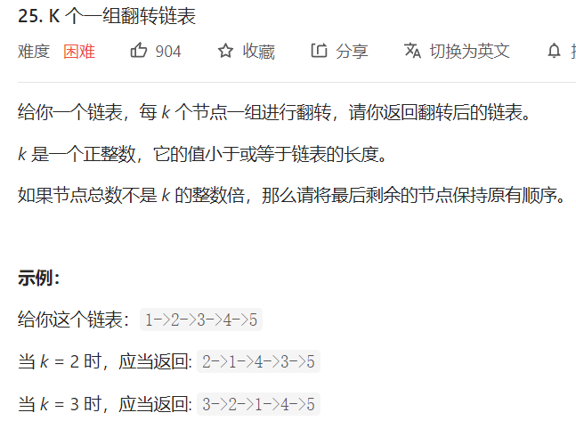

# 25. K 个一组翻转链表

## 题目



## 思路

这题在206题的基础上多了分组。

衔接问题：

前一组`原来的头`与后一组反转后`新的头`进行拼接。

如果，后一组元数不够k个，不需要反转，直接返回`原来的头`，与前一组`原来的头`进行拼接。


## 解题

```javascript
/**
 * Definition for singly-linked list.
 * function ListNode(val, next) {
 *     this.val = (val===undefined ? 0 : val)
 *     this.next = (next===undefined ? null : next)
 * }
 */
/**
 * @param {ListNode} head
 * @param {number} k
 * @return {ListNode}
 */
const reverseFn = (head, end) => {

    let pre = null;
    let cur = head;
    let next = null;

    while(cur !== end) {
        next = cur.next;

        cur.next = pre;
        pre = cur;
        cur = next;
    }

    return pre
}
 
var reverseKGroup = function(head, k) {

    if(head === null) return null;
    let a = head, b = head;

    // 检查是否够k个元素，不够直接返回头
    for(let i = 0; i < k; i++) { 
        if(b === null) return head;
        b = b.next;
    }
    // 反转区间是 [a, b)
    const newHead = reverseFn(a, b)
    // 拼接。原来的头，拼接下一个分组新的头
    a.next = reverseKGroup(b, k);
    return newHead
};
```


